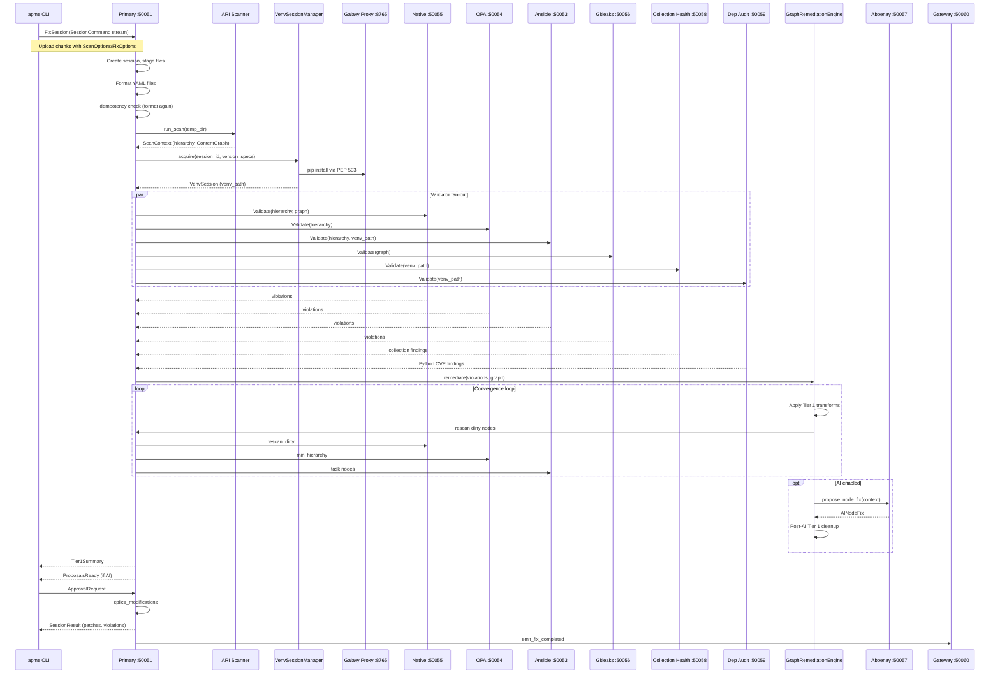

# 00 — Pipeline Overview

> Previous: (start) | Next: [01 — Initialization and Ingestion](01-initialization-and-ingestion.md)

## Purpose

APME processes Ansible content through a multi-stage pipeline that detects
policy violations, applies deterministic fixes, optionally proposes AI-assisted
fixes, and reports results. This document maps the full pipeline and explains
how the three user-facing commands share the same infrastructure.

## End-to-End Pipeline

## Three Commands, One Pipeline

All three user-facing commands use the `FixSession` bidirectional streaming RPC
(ADR-039). The differences are in options and client-side behavior:

| Aspect | `check` | `remediate` | `format` |
|--------|---------|-------------|----------|
| RPC | `FixSession` | `FixSession` | `Format` / `FormatStream` |
| `FixOptions` | Not set (check mode) | Set (max_passes, AI flags) | N/A |
| Proposals | Auto-declined (`approved_ids=[]`) | Interactive or `--auto-approve` | N/A |
| File writes | Never | Writes patches to disk | `--apply` writes formatted files |
| Exit code | 0=clean, 1=violations | 0=clean, 1=remaining | 0=clean, 1=would change |

### check

Runs the full pipeline (format + scan + Tier 1 remediation) in read-only
mode. Shows what `remediate` would change without touching files. AI proposals
are automatically declined.

### remediate

Runs the full pipeline and writes patched files. With `--ai`, Tier 2 proposals
are generated and presented for interactive review (or `--auto-approve`).

### format

YAML-only formatting via the `Format`/`FormatStream` RPCs. Does not scan or
remediate. Separate from the `FixSession` path.

## Service Topology

The pipeline spans multiple services within the APME pod:

| Service | Port | Role in pipeline |
|---------|------|------------------|
| Primary | 50051 | Orchestrator — sole API surface |
| Native validator | 50055 | Python graph rules (L/M/R series) |
| OPA validator | 50054 | Rego policy rules (P series) |
| Ansible validator | 50053 | Runtime checks using session venv |
| Gitleaks validator | 50056 | Secrets detection (SEC series) |
| Collection Health | 50058 | Installed collection lint/modernize checks |
| Dep Audit | 50059 | Python CVE scanning via pip-audit |
| Galaxy Proxy | 8765 | PEP 503 index for collection installs |
| Abbenay | 50057 | AI fix proposals (optional) |
| Gateway | 50060/8080 | Persistence + REST API (pod-level) |
| UI | 8081 | React SPA (pod-level) |

## Key Source Files

| File | Role |
|------|------|
| `src/apme_engine/cli/__init__.py` | CLI entry point and command dispatch |
| `src/apme_engine/daemon/primary_server.py` | Primary orchestrator (`PrimaryServicer`) |
| `src/apme_engine/runner.py` | ARI scanner adapter (`run_scan`) |
| `src/apme_engine/engine/scanner.py` | ARI scanner (`ARIScanner.evaluate`) |
| `src/apme_engine/engine/content_graph.py` | `ContentGraph` model |
| `src/apme_engine/remediation/graph_engine.py` | `GraphRemediationEngine` convergence loop |
| `src/apme_engine/venv_manager/session.py` | `VenvSessionManager` |
| `src/apme_engine/daemon/event_emitter.py` | Event sink fan-out |

## Key ADRs

| ADR | Relevance |
|-----|-----------|
| ADR-001 | gRPC for all inter-service communication |
| ADR-007 | Async gRPC (grpc.aio) for all servers |
| ADR-009 | Validators are read-only; remediation is separate |
| ADR-022 | Primary is sole venv writer |
| ADR-028/039 | FixSession bidirectional streaming |
| ADR-044 | ContentGraph as the remediation working copy |

---

> Next: [01 — Initialization and Ingestion](01-initialization-and-ingestion.md)
