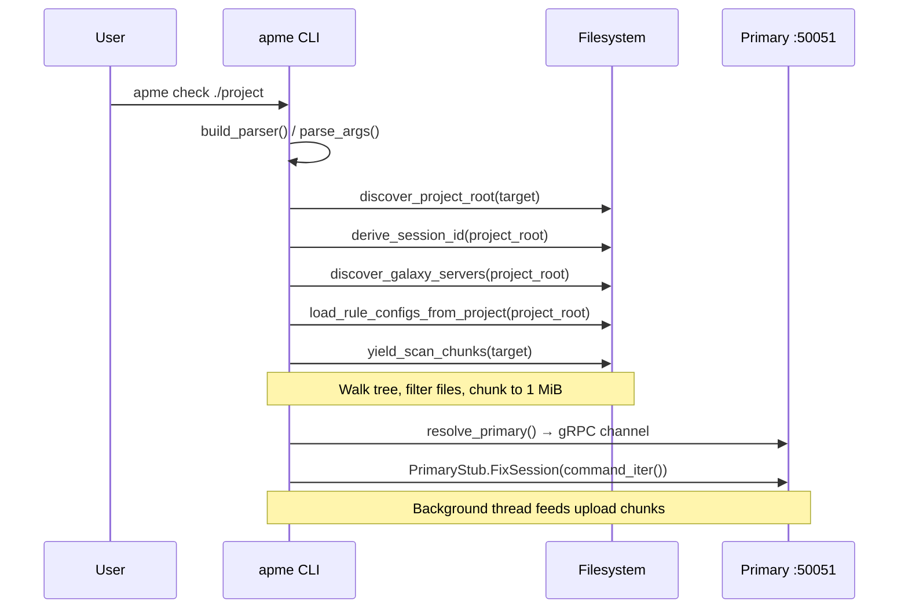

# 01 — Initialization and Ingestion

> Previous: [00 — Pipeline Overview](00-overview.md) | Next: [02 — Session Management](02-session-management.md)

## Purpose

This stage covers everything from the user typing `apme check` (or
`remediate`) to the first bytes arriving at the Primary orchestrator over
gRPC. It includes CLI argument parsing, project root discovery, filesystem
walking, chunked serialization, and gRPC channel setup.

## Sequence



## CLI Entry Point

`src/apme_engine/cli/__init__.py` — `main()` parses arguments via
`build_parser()`, disables ANSI if requested, then dispatches by subcommand.
For `check` and `remediate`, the respective `run_check` / `run_remediate`
functions are called.

`src/apme_engine/cli/parser.py` — `build_parser()` defines all subcommands
and their flags. Key flags for this stage:

- `target` — path to playbook, role, or project (default `.`)
- `--session` — explicit session ID for venv reuse
- `--ansible-version` — ansible-core version constraint
- `--collections` — additional collection specs
- `--timeout` — gRPC timeout (check: 120s, remediate: 600s)

## Project Discovery

Before scanning, the CLI resolves context from the project root:

1. **`discover_project_root(target)`** — walks up from target to find the
   project boundary (git root, `galaxy.yml`, etc.).

2. **`derive_session_id(project_root)`** — deterministic 16-char hex SHA-256
   of the project root path. Used for venv reuse across scans.

3. **`discover_galaxy_servers(project_root)`** — reads Galaxy server
   definitions from project-level config (ADR-045).

4. **`load_rule_configs_from_project(project_root)`** — reads
   `.apme/rules.yml` for per-rule overrides (ADR-041).

## Filesystem Walk and Chunking

`src/apme_engine/daemon/chunked_fs.py` handles converting a local path into
a stream of `ScanChunk` proto messages.

### build_scan_bundle()

Walks the target path (or reads a single file), filtering by:

- **SKIP_DIRS** — `.git`, `__pycache__`, `.venv`, `node_modules`, `.tox`, etc.
- **TEXT_EXTENSIONS** — `.yml`, `.yaml`, `.json`, `.j2`, `.py`, `.sh`, etc.
- **MAX_FILE_SIZE** — 2 MiB per file
- **Binary detection** — skips files with null bytes in first 8 KiB
- **.apmeignore** — project-level glob patterns for exclusion

Each included file becomes a `File` proto message with `path` (relative to
project root) and `content` (raw bytes).

### yield_scan_chunks()

Splits the collected files into chunks of at most 1 MiB (`CHUNK_MAX_BYTES`).
The first chunk carries `scan_id`, `project_root`, and `ScanOptions`; subsequent
chunks carry only files. The last chunk has `last=True`.

For `remediate`, the first chunk also carries `FixOptions` (max_passes,
`enable_ai`, `ai_model`, `session_id`, Galaxy servers).

## gRPC Channel Setup

`src/apme_engine/cli/discovery.py` — `resolve_primary(args)` finds the Primary
daemon address:

1. Checks for a running local daemon (socket file)
2. Falls back to `APME_PRIMARY_ADDRESS` env var
3. Auto-starts a daemon if needed

Returns a `grpc.Channel` and address string.

## Upload Threading Model

Both `check` and `remediate` use a background thread to feed upload chunks
into a `queue.Queue`, with the main thread consuming `SessionEvent` responses:

```
┌─────────────────┐      queue.Queue      ┌──────────────────┐
│ Upload thread   │ ──→ SessionCommand ──→ │ Main thread      │
│ (chunks)        │                        │ (event consumer) │
└─────────────────┘                        └──────────────────┘
         ↓                                          ↑
   yield_scan_chunks()                    stub.FixSession()
```

The `command_iter()` generator yields from the queue until a `None` sentinel
signals completion. Interactive commands (approval, extend, close) are also
pushed onto this queue from the main thread.

## Key Proto Messages

From `proto/apme/v1/primary.proto`:

- **`ScanChunk`** — `scan_id`, `project_root`, `options`, `files[]`, `last`,
  `fix_options`
- **`ScanOptions`** — `ansible_core_version`, `collection_specs[]`,
  `session_id`, `galaxy_servers[]`, `rule_configs[]`
- **`FixOptions`** — `max_passes`, `enable_ai`, `ai_model`, `session_id`,
  `galaxy_servers[]`
- **`SessionCommand`** — oneof: `upload`, `approve`, `extend`, `close`,
  `resume`

## Key Source Files

| File | Key functions |
|------|---------------|
| `src/apme_engine/cli/__init__.py` | `main()` |
| `src/apme_engine/cli/parser.py` | `build_parser()` |
| `src/apme_engine/cli/check.py` | `run_check()`, `_resolve_session_id()` |
| `src/apme_engine/cli/remediate.py` | `run_remediate()` |
| `src/apme_engine/daemon/chunked_fs.py` | `yield_scan_chunks()`, `build_scan_bundle()` |
| `src/apme_engine/cli/discovery.py` | `resolve_primary()` |

---

> Next: [02 — Session Management](02-session-management.md)
