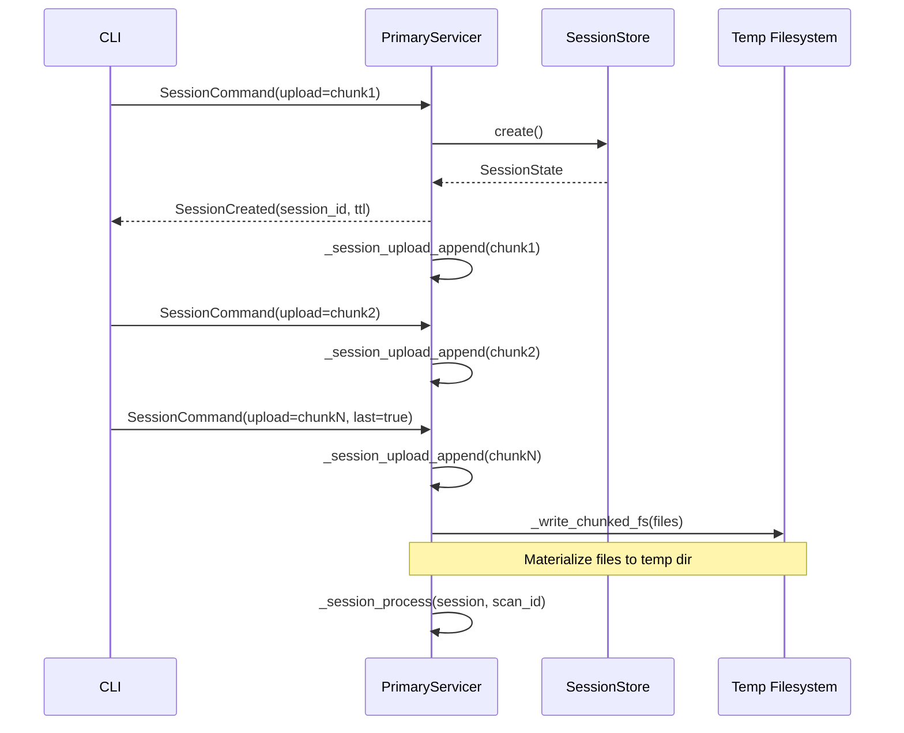

# 02 — Session Management

> Previous: [01 — Initialization and Ingestion](01-initialization-and-ingestion.md) | Next: [03 — Formatting](03-formatting.md)

## Purpose

When the Primary receives the first `ScanChunk` via `FixSession`, it creates a
session, accumulates uploaded files, and stages them to a temp directory. This
stage covers session lifecycle, the command dispatch loop, and file staging.

## Sequence

## FixSession Command Loop

`PrimaryServicer.FixSession()` is the bidirectional streaming handler. It
iterates over incoming `SessionCommand` messages and dispatches on
`cmd.WhichOneof("command")`:

| Command | Action |
|---------|--------|
| `upload` | First chunk: `_session_upload_start()` → `SessionCreated`. All chunks: `_session_upload_append()`. Last chunk: `_session_process()`. |
| `approve` | `_session_apply_approved()` → `ApprovalAck`. If COMPLETE: `_session_build_result()`. |
| `extend` | `session.touch()` → re-emit `SessionCreated` with refreshed TTL. |
| `resume` | Lookup session in store → replay state via `_session_replay_state()`. |
| `close` | Remove from store → `SessionClosed`. |

## SessionStore and SessionState

`src/apme_engine/daemon/session.py` manages in-memory session state:

**SessionStore** maintains a dict of active sessions. It enforces a maximum
concurrent session count (raising `ResourceExhaustedError` if exceeded) and
runs a background reaper task that removes expired sessions.

**SessionState** holds all mutable state for one session:

| Field | Purpose |
|-------|---------|
| `session_id` | Unique identifier |
| `scan_id` | Correlation ID from the first chunk |
| `status` | UPLOADING → PROCESSING → AWAITING_APPROVAL → COMPLETE |
| `original_files` | `dict[path, bytes]` — pristine uploaded content |
| `working_files` | `dict[path, bytes]` — mutated by format/remediation |
| `fix_options` | From first chunk's `FixOptions` (remediate mode) |
| `scan_options` | From first chunk's `ScanOptions` |
| `temp_dir` | Path to materialized files |
| `content_graph` | `ContentGraph` after scan (used for approval) |
| `graph_originals` | Original file text for splice_modifications |
| `proposals` | `dict[id, Proposal]` — pending AI proposals |
| `tier1_patches` | Applied Tier 1 patches |
| `report` | `FixReport` from convergence |
| `progress_logs` | `ProgressUpdate` entries for replay |
| `ttl_seconds` | Time-to-live before expiry |

## File Staging

`_session_upload_start()` creates the session and extracts metadata from the
first chunk (scan_id, project_root, options).

`_session_upload_append()` copies each `File` proto's content into both
`original_files` and `working_files` dicts, keyed by relative path.

When the last chunk arrives (`chunk.last = True`), `_write_chunked_fs()`
materializes all files into a temp directory. Paths are sanitized — absolute
paths and `..` segments are rejected to prevent directory traversal.

## Session TTL and Lifecycle

Sessions have a configurable TTL (default from `SessionStore`). The session
is touched (TTL refreshed) on:

- Each `extend` command
- Each `approve` command
- Each `resume` command

The background reaper periodically scans for expired sessions and removes
them. Clients receive `ExpirationWarning` events when their session is
about to expire.

## Session Resume

Clients can reconnect to an existing session via `ResumeRequest(session_id)`.
The Primary looks up the session in the store and replays its current state:

- If Tier 1 is complete: re-emit `Tier1Summary`
- If awaiting approval: re-emit `ProposalsReady`
- If complete: re-emit `SessionResult`

## Key Source Files

| File | Key types/functions |
|------|---------------------|
| `src/apme_engine/daemon/primary_server.py` | `PrimaryServicer.FixSession()`, `_session_upload_start()`, `_session_upload_append()`, `_write_chunked_fs()` |
| `src/apme_engine/daemon/session.py` | `SessionStore`, `SessionState`, `ResourceExhaustedError` |

## Related ADRs

- **ADR-028** — FixSession bidirectional streaming design
- **ADR-039** — Unified check/remediate through FixSession

---

> Next: [03 — Formatting](03-formatting.md)
