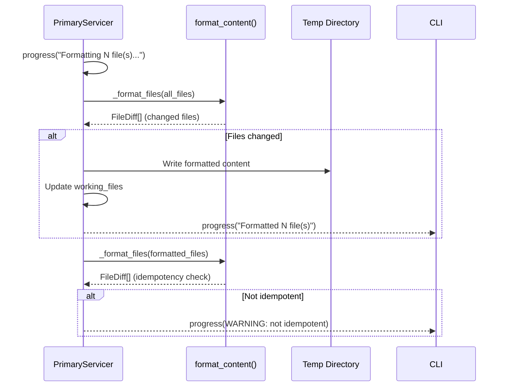

# 03 — Formatting

> Previous: [02 — Session Management](02-session-management.md) | Next: [04 — Parse and Graph Construction](04-parse-and-graph.md)

## Purpose

Before scanning, the Primary normalizes all YAML files to a consistent format.
This ensures that formatting differences do not produce false-positive
violations. A second format pass verifies idempotency.

## Sequence

## Format Phase

Inside `_session_process()`, the format phase runs as Phase 1:

1. **Format pass** — `_format_files()` is called in an executor
   (`run_in_executor`) on all uploaded files. Only `.yml` and `.yaml` files
   are processed. Each file is run through `format_content()` from
   `src/apme_engine/formatter.py`.

2. **Apply changes** — For files whose content changed, the formatted bytes
   are written to the temp directory and stored in `session.working_files`.
   A `FileDiff` proto is created with original and formatted content plus a
   unified diff.

3. **Idempotency check** — The formatter runs again on the already-formatted
   files. If any diffs are produced, `session.idempotency_ok` is set to
   `False` and a warning is emitted. This catches formatter bugs or
   pathological inputs.

## What the Formatter Does

`format_content()` normalizes YAML formatting:

- Consistent indentation (2 spaces)
- Key ordering within tasks and plays
- Jinja2 spacing normalization
- Trailing whitespace and newline cleanup
- Quote style consistency

The formatter uses `ruamel.yaml` for comment-preserving round-trips.

## Format Diffs in the Pipeline

Format diffs are captured on the session and included in the final
`Tier1Summary` event sent to the client. This lets `check` mode show what
formatting changes would be applied, and `remediate` mode includes them
in the written patches.

The diffs are also stored in `session.format_diffs` for session resume
replay.

## Standalone Format Command

`apme format` uses a separate code path — the `Format` (unary) and
`FormatStream` (streaming) RPCs, defined in `primary.proto`. These bypass the
full `FixSession` pipeline and return `FormatResponse` with diffs directly.

The CLI's `format_cmd.py` handles:
- `--apply` — writes formatted files in place
- `--check` — exits with code 1 if any files would change (CI mode)
- `--exclude` — glob patterns to skip

## Key Source Files

| File | Key functions |
|------|---------------|
| `src/apme_engine/daemon/primary_server.py` | `_format_files()`, `_session_process()` (Phase 1-2) |
| `src/apme_engine/formatter.py` | `format_content()` |
| `src/apme_engine/cli/format_cmd.py` | `run_format()` |

---

> Next: [04 — Parse and Graph Construction](04-parse-and-graph.md)
