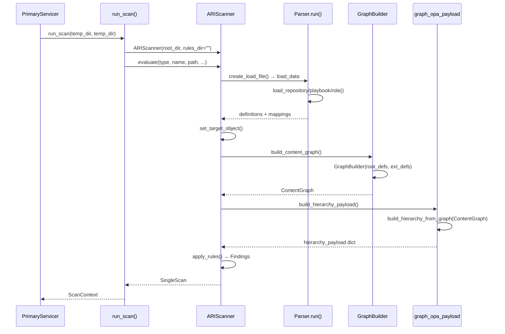

# 04 — Parse and Graph Construction

> Previous: [03 — Formatting](03-formatting.md) | Next: [05 — Collection Resolution](05-collection-resolution.md)

## Purpose

After formatting, the engine parses Ansible content into typed definitions,
builds a `ContentGraph` representing the project structure, and produces a
hierarchy payload for validators. This is the analytical core of the pipeline.

## Sequence



## run_scan() — The Adapter

`src/apme_engine/runner.py` — `run_scan()` is a thin adapter between the
Primary and the vendored ARI engine:

1. Creates an `ARIScanner` with `rules_dir=""` (no native rules at scan time;
   rules live in validators).
2. Determines `scan_type` — `"playbook"` for a single file, `"project"` for a
   directory.
3. Calls `scanner.evaluate()` with `load_all_taskfiles=True`,
   `include_test_contents=True`, and `dependency_dir` from any warm session
   venv.
4. Extracts `ScanContext` from the scanner's `SingleScan`:
   - `hierarchy_payload` — JSON structure for OPA/Ansible validators
   - `scandata` — the `SingleScan` object for native validator
   - `engine_diagnostics` — timing data

## ARIScanner.evaluate() — The ARI Pipeline

`src/apme_engine/engine/scanner.py` — `evaluate()` runs the ARI pipeline:

| Phase | Timed As | What Happens |
|-------|----------|--------------|
| Metadata load | `metadata_load` | Optional RAM cache lookup for non-local targets |
| Dependency load | `dependency_load` | Recursive `evaluate(..., load_only=True)` for dependencies |
| PRM load | `prm_load` | Placeholder timing bucket |
| Target load | `target_load` | `load_definitions_root()` — parse Ansible content |
| Set target | — | `set_target_object()` — pick the root `Object` |
| Graph construction | `graph_construction` | `build_content_graph()` → `ContentGraph` |
| Apply rules | `apply_rules` | `build_hierarchy_payload()` + create `Findings` |

## Parsing

`src/apme_engine/engine/parser.py` — `Parser.run()` dispatches by load type:

- **Collection** → `load_collection()`
- **Role** → `load_role()`
- **Project** → `load_repository()`
- **Playbook** → `load_playbook()` or `load_repository()` with
  `target_playbook_path`
- **Taskfile** → `load_taskfile()` or `load_repository()` with
  `target_taskfile_path`

The parser produces a `definitions` dict mapping object types to lists of
parsed `Object` instances (collections, roles, playbooks, plays, taskfiles,
tasks, modules, files) and a `Load` object with path mappings.

## ContentGraph Construction

`src/apme_engine/engine/scan_state.py` — `build_content_graph()`:

```python
builder = GraphBuilder(root_definitions, ext_definitions)
self.content_graph = builder.build()
```

`src/apme_engine/engine/content_graph.py` — `GraphBuilder` takes parsed
definitions and constructs a directed acyclic graph:

- **Nodes** — `ContentNode` objects representing plays, tasks, blocks,
  handlers, roles, taskfiles. Each node carries:
  - `node_id` — stable YAML-path-based identity
  - `node_type` — play, task, block, handler, etc.
  - `file_path` — source file
  - `line_start` / `line_end` — line range in the source
  - `yaml_lines` — raw YAML text for this node
  - `variables`, `become`, `tags`, `when_expr`, `environment` — inherited context

- **Edges** — parent-child relationships (play→task, block→task, role→taskfile)

The graph is the authoritative data structure for remediation. Transforms
operate on it, dirty nodes are rescanned, and `splice_modifications()` writes
changes back to files.

## Hierarchy Payload

`src/apme_engine/engine/graph_opa_payload.py` —
`build_hierarchy_from_graph()` serializes the `ContentGraph` into a JSON
structure consumed by OPA and Ansible validators:

```json
{
  "scan_id": "...",
  "hierarchy": [
    {
      "root_key": "playbook|role|...",
      "root_type": "playbook|role|...",
      "root_path": "/path/to/root",
      "nodes": [
        {
          "key": "node_id",
          "type": "taskcall|play|block|...",
          "module": "ansible.builtin.copy",
          "name": "Copy config file",
          "options": {...},
          "path": "tasks/main.yml",
          "line": [10, 15],
          ...
        }
      ]
    }
  ],
  "collection_set": ["community.general", "ansible.posix"],
  "metadata": {...}
}
```

This payload carries enough context for validators to evaluate rules without
needing the full `ContentGraph` or parsed definitions.

## EngineDiagnostics

`runner.py` — `_extract_engine_diagnostics()` extracts timing data from
the scanner's `time_records`:

- `parse_ms` — sum of `target_load` + `prm_load` + `metadata_load`
- `tree_build_ms` — `graph_construction` elapsed time
- `files_scanned` — count of root definitions
- `graph_nodes_built` — `ContentGraph.node_count()`

These diagnostics are embedded in `ScanDiagnostics` and exposed via `-v`/`-vv`
output.

## Key Source Files

| File | Key types/functions |
|------|---------------------|
| `src/apme_engine/runner.py` | `run_scan()`, `_extract_engine_diagnostics()` |
| `src/apme_engine/engine/scanner.py` | `ARIScanner`, `evaluate()` |
| `src/apme_engine/engine/scan_state.py` | `SingleScan`, `build_content_graph()`, `build_hierarchy_payload()` |
| `src/apme_engine/engine/parser.py` | `Parser.run()` |
| `src/apme_engine/engine/content_graph.py` | `ContentGraph`, `ContentNode`, `GraphBuilder` |
| `src/apme_engine/engine/graph_opa_payload.py` | `build_hierarchy_from_graph()` |
| `src/apme_engine/validators/base.py` | `ScanContext`, `EngineDiagnostics` |

## Related ADRs

- **ADR-003** — Vendored ARI engine (not a pip dependency)
- **ADR-044** — ContentGraph as the remediation working copy

---

> Next: [05 — Collection Resolution](05-collection-resolution.md)
