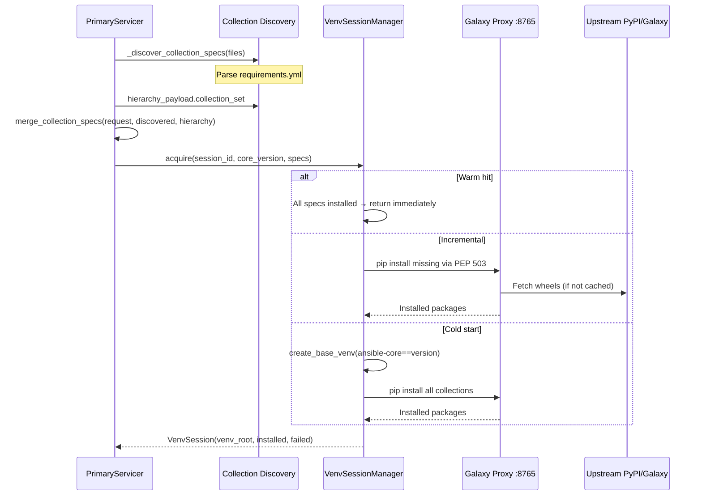

# 05 — Collection Resolution and Venv Management

> Previous: [04 — Parse and Graph Construction](04-parse-and-graph.md) | Next: [06 — Validator Fan-out](06-validator-fanout.md)

## Purpose

Ansible validation requires installed collections (for module argument specs,
`ansible-lint` integration, etc.). The Primary creates a session-scoped virtual
environment, installs the required `ansible-core` version and collections via
the Galaxy Proxy, and passes the venv path to validators.

## Sequence



## Collection Discovery

Collections are discovered from three sources, merged with precedence:

1. **Request specs** (highest) — `ScanOptions.collection_specs` or
   `FixOptions.collection_specs` from the client CLI (`--collections`).

2. **requirements.yml** — `_discover_collection_specs()` parses
   `requirements.yml` and `collections/requirements.yml` from the uploaded
   files. Extracts `namespace.collection[:version]` specs.

3. **Hierarchy FQCNs** (lowest) — `collection_set` from the hierarchy
   payload, which contains bare namespace.collection strings discovered from
   FQCN usage in tasks (e.g., `community.general.ini_file` → `community.general`).

`merge_collection_specs()` deduplicates by bare name, with versioned specs
from earlier sources taking priority.

## Galaxy Proxy

The Galaxy Proxy (`src/galaxy_proxy/`) is a PEP 503 simple index that bridges
Galaxy/Automation Hub collections to pip-installable wheels. It is the
**sole collection installation path** — validators and the CLI daemon cannot
scan without it.

Collections are installed as pip packages using the naming convention:
`community.general:9.0.0` → `ansible-collection-community-general==9.0.0`

The proxy caches downloaded wheels and serves them via its simple index at
`http://localhost:8765/simple/`.

## VenvSessionManager

`src/apme_engine/venv_manager/session.py` manages session-scoped venvs.

### Storage Layout

```
$SESSIONS_ROOT/
    <session_id>/
        <core_version>/
            venv/           # the virtualenv
            meta.json       # installed_collections, timestamps
        session.json        # session-level metadata
        .lock               # fcntl.flock target
```

### acquire() — Three Paths

| Path | When | What happens |
|------|------|-------------|
| **Warm hit** | Venv exists, all specs already installed | Return immediately (sub-millisecond) |
| **Incremental** | Venv exists but missing some collections | Install only the delta via proxy |
| **Cold start** | No venv for this session+version | Create venv, install ansible-core, install all collections |

Concurrency safety is ensured via `fcntl.flock` on a `.lock` file per session
directory. Multiple scanners sharing the same session ID serialize venv
creation but can read concurrently once the venv is ready.

### Failure Handling

Individual collection install failures are **non-fatal**. The scan continues
with whatever collections could be installed. Failed specs are recorded in
`VenvSession.failed_collections` and logged as warnings.

### Warm Venv Hint

Before the ARI tree build, the Primary checks for a warm session venv. If one
exists, its `site-packages` path is passed as `dependency_dir` to
`run_scan()`, allowing ARI to resolve pre-installed collection definitions
without downloading them again.

## Venv Authority Model (ADR-022)

The Primary is the **sole writer** to session venvs. Validators receive a
read-only `venv_path` in the `ValidateRequest` proto. In the Podman pod,
the `/sessions` volume is mounted read-write for Primary and read-only for
validator containers.

## Session Reaping

`VenvSessionManager.reap_expired()` deletes individual core-version venvs
whose `last_used_at` exceeds the TTL (default 3600s). If all venvs under a
session directory are reaped, the session directory is removed entirely.

## Key Source Files

| File | Key types/functions |
|------|---------------------|
| `src/apme_engine/daemon/primary_server.py` | `_discover_collection_specs()`, `merge_collection_specs()`, `_scan_pipeline()` step 2-3 |
| `src/apme_engine/venv_manager/session.py` | `VenvSessionManager`, `VenvSession`, `create_base_venv()`, `install_collections_incremental()` |
| `src/galaxy_proxy/` | Galaxy Proxy PEP 503 implementation |

## Related ADRs

- **ADR-022** — Session-scoped venvs, Primary as sole writer
- **ADR-031** — Galaxy Proxy PEP 503 design
- **ADR-045** — Galaxy server configuration

---

> Next: [06 — Validator Fan-out](06-validator-fanout.md)
