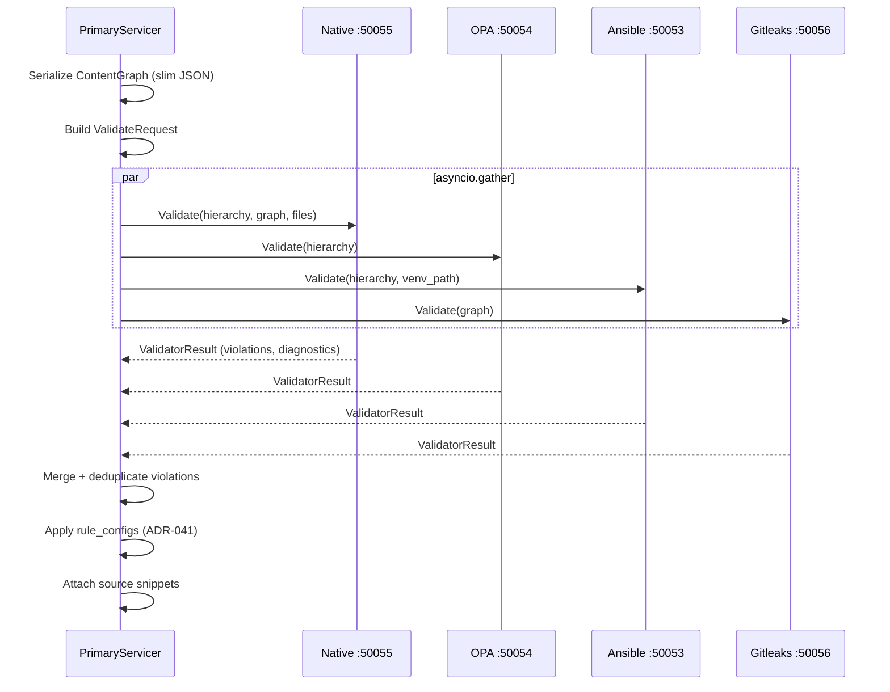

# 06 — Validator Fan-out and Violation Detection

> Previous: [05 — Collection Resolution](05-collection-resolution.md) | Next: [07 — Tier 1 Deterministic Remediation](07-tier1-remediation.md)

## Purpose

After the engine produces a `ContentGraph` and hierarchy payload, the Primary
fans out validation requests to all configured validators in parallel. Each
validator applies its rules and returns violations. Results are merged,
deduplicated, and optionally filtered by rule configs.

## Sequence



## Unified Validator Contract

Every validator implements the same gRPC service defined in
`proto/apme/v1/validate.proto`:

```protobuf
service Validator {
  rpc Validate(ValidateRequest) returns (ValidateResponse);
  rpc Health(HealthRequest) returns (HealthResponse);
}
```

**ValidateRequest** carries:

| Field | Used By |
|-------|---------|
| `hierarchy_payload` (JSON bytes) | OPA, Ansible |
| `content_graph_data` (slim JSON bytes) | Native, Gitleaks |
| `files` (File protos) | All (for path reference) |
| `venv_path` | Ansible (read-only) |
| `session_id` | Ansible (session context) |
| `ansible_core_version` | Ansible |
| `request_id` | All (correlation) |

**ValidateResponse** returns:
- `violations[]` — `Violation` protos
- `diagnostics` — `ValidatorDiagnostics` with timing/counts
- `logs[]` — `ProgressUpdate` entries (ADR-033)

## Validator Discovery

Validators are discovered via environment variables:

| Env Var | Validator |
|---------|-----------|
| `NATIVE_GRPC_ADDRESS` | Native (graph rules) |
| `OPA_GRPC_ADDRESS` | OPA (Rego policy rules) |
| `ANSIBLE_GRPC_ADDRESS` | Ansible (runtime checks) |
| `GITLEAKS_GRPC_ADDRESS` | Gitleaks (secrets detection) |

Only validators with configured addresses are called. Missing validators
are silently skipped — the fan-out adapts to the available services.

## Per-Validator Details

### Native Validator (:50055)

Deserializes `content_graph_data` into a `ContentGraph`, then runs
`GraphRule` subclasses via `graph_scanner.scan()`. Rules live under
`src/apme_engine/validators/native/rules/`.

Rule ID prefixes: **L** (lint), **M** (modernize), **R** (risk).

### OPA Validator (:50054)

Runs `opa eval` via subprocess on the hierarchy JSON payload. Rego policy
rules live in the OPA bundle shipped with the container image.

Rule IDs follow the bundled Rego rules and use **L**, **M**, and **R**
prefixes. No HTTP REST server — OPA is invoked as a subprocess
(architectural invariant 9).

### Ansible Validator (:50053)

Runtime checks using the session-scoped venv. Validates module arguments,
deprecated modules, and runtime behavior against the installed `ansible-core`
version. Mounts the session venv **read-only** (ADR-022).

### Gitleaks Validator (:50056)

Invokes the `gitleaks` binary on serialized content from `content_graph_data`.
Detects hardcoded secrets, tokens, and credentials.

Rule ID prefix: **SEC** (secrets). Optional — requires the external `gitleaks`
binary.

## Fan-out Mechanics

`_scan_pipeline()` in `primary_server.py` uses `asyncio.gather()` with
`return_exceptions=True` for graceful degradation:

- Each validator call is wrapped in `_call_validator()` which opens an async
  gRPC channel, sends the request, and returns a `_ValidatorResult`.
- On failure, `_call_validator` logs the error and returns an empty result —
  the scan continues without that validator's findings.
- Progress callbacks report per-validator completion with violation counts
  and rule IDs.

## Post-Fan-out Processing

After all validators return:

1. **Merge** — all violations are concatenated.
2. **Sort** — by file path then line number for stable ordering.
3. **Deduplicate** — by `(rule_id, file, line)` tuple.
4. **Rule configs** — if `ScanOptions.rule_configs` is set:
   - Disabled rules are filtered out
   - Severity overrides are applied
   - Enforced rules are marked (bypasses `# apme:ignore`)
5. **Snippets** — `_attach_snippets()` extracts ~10 lines of context around
   each violation from the uploaded file content.

## Diagnostics

`ScanDiagnostics` aggregates timing data:

- `engine_parse_ms`, `engine_total_ms` — from ARI scanner
- `fan_out_ms` — wall clock time for the `asyncio.gather` call
- `validators[]` — per-validator `ValidatorDiagnostics` with rule timings
- `total_ms` — end-to-end scan pipeline time

Displayed with `apme check -v` (summary) or `-vv` (per-rule breakdown).

## Key Source Files

| File | Key types/functions |
|------|---------------------|
| `src/apme_engine/daemon/primary_server.py` | `_scan_pipeline()` step 4, `_call_validator()`, `VALIDATOR_ENV_VARS` |
| `src/apme_engine/validators/base.py` | `Validator` protocol, `ScanContext` |
| `proto/apme/v1/validate.proto` | `Validator` service, `ValidateRequest`, `ValidateResponse` |
| `src/apme_engine/validators/native/` | Native graph rule implementations |
| `src/apme_engine/validators/opa/` | OPA subprocess integration |
| `src/apme_engine/validators/ansible/` | Ansible runtime validator |
| `src/apme_engine/validators/gitleaks/` | Gitleaks binary integration |

## Related ADRs

- **ADR-001** — gRPC for inter-service communication
- **ADR-002** — OPA subprocess (not REST)
- **ADR-007** — Async gRPC servers
- **ADR-008** — Rule ID conventions (L/M/R/P/SEC)
- **ADR-010** — Unified validator contract
- **ADR-041** — Rule catalog and overrides

---

> Next: [07 — Tier 1 Deterministic Remediation](07-tier1-remediation.md)
