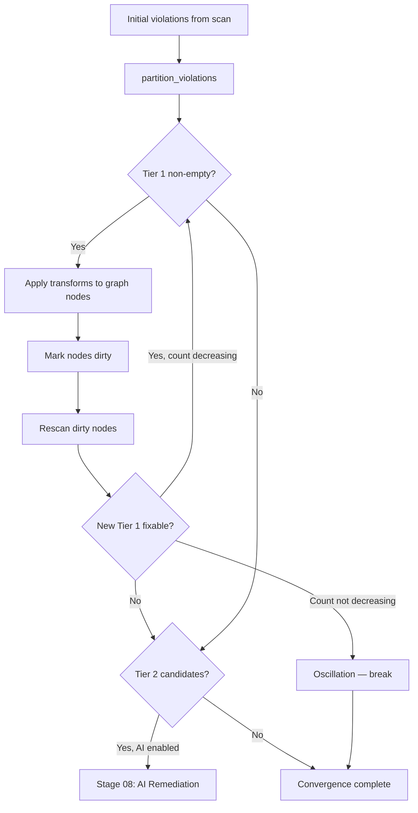

# 07 — Tier 1 Deterministic Remediation

> Previous: [06 — Validator Fan-out](06-validator-fanout.md) | Next: [08 — AI-Assisted Remediation](08-ai-remediation.md)

## Purpose

Tier 1 remediation applies deterministic transforms to fix violations that
have known, mechanical solutions. The convergence loop applies transforms,
rescans dirty nodes, and repeats until no more Tier 1 violations can be
fixed or the pass limit is reached.

## Sequence



## Violation Partitioning

`src/apme_engine/remediation/partition.py` — `partition_violations()` routes
each violation to one of three tiers:

| Tier | Criteria | Example |
|------|----------|---------|
| **Tier 1** | Registry has a deterministic transform | L007, L013, M001 |
| **Tier 2** | Scope is `task` or `block`, not cross-file, `ai_proposable=True` | L011 (complex naming) |
| **Tier 3** | Play/role/collection scope, cross-file rules, or `info` severity | R111, R112, play-level |

The routing uses scope metadata (ADR-026) rather than hardcoded rule lists.
Cross-file rules (R111, R112) are always Tier 3 because their fix requires
role/taskfile inventory context.

## TransformRegistry

`src/apme_engine/remediation/registry.py` — `TransformRegistry` maps rule IDs
to node-level transform functions:

```python
NodeTransformFn = Callable[[CommentedMap, ViolationDict], bool]
```

Each transform receives a `ruamel.yaml` `CommentedMap` (the parsed task/block)
and the violation dict. It modifies the map in-place and returns `True` if a
change was made. Transforms preserve YAML comments because they operate on
`ruamel.yaml` objects, not raw strings.

`src/apme_engine/remediation/transforms/__init__.py` —
`build_default_registry()` registers all built-in transforms (L007–L046,
M001–M009, etc.).

## ContentGraph.apply_transform()

The `ContentGraph` is the mutable working copy (ADR-044). When a transform
is applied:

1. The node's `yaml_lines` are parsed with `ruamel.yaml` into a
   `CommentedMap`.
2. The transform function modifies the map.
3. The modified map is dumped back to YAML text.
4. `node.update_from_yaml()` stores the new text and updates the content
   hash.
5. The node is added to the graph's dirty set.

## Convergence Loop

`GraphRemediationEngine.remediate()` in
`src/apme_engine/remediation/graph_engine.py`:

```
for pass_num in 1..max_passes:
    tier1, tier2, _ = partition_violations(violations, registry)

    if tier1:
        applied = _apply_tier1(graph, registry, tier1)
        if applied == 0: break

        violations = _rescan_and_record(graph, pass_num)
        if new_fixable >= prev_count:
            # Oscillation detected — break
            break
        if new_fixable > 0:
            continue  # Next pass

    # If tier1 exhausted → move to AI (Stage 08)
```

### Oscillation Detection

If the number of Tier 1 fixable violations does not decrease between passes,
the loop breaks with `oscillation_detected=True`. This prevents infinite
loops where Transform A introduces a violation that Transform B fixes, which
re-introduces the original violation.

### Rescan Bridge

During convergence, only dirty nodes are rescanned — not the full project.
The rescan uses multiple strategies depending on the validator:

| Validator | Rescan Method |
|-----------|---------------|
| Native | `rescan_dirty()` — in-process graph rules on dirty nodes |
| OPA | Mini hierarchy payload from `content_node_to_opa_dict()` |
| Ansible | Scoped task nodes from dirty set |
| Gitleaks | Slim graph data from dirty node YAML |

All external validator rescans are dispatched via `_rescan_bridge()` in
`primary_server.py`, which uses `asyncio.gather()` for parallel execution.

### Auto-Approval

After the convergence loop completes, deterministic transforms are
auto-approved:

```python
graph.approve_pending(source_filter="deterministic")
```

This promotes all progression entries sourced from deterministic transforms
so that `splice_modifications()` can include them in the final patches.
AI-sourced changes remain pending for human review.

## Example Transform

`src/apme_engine/remediation/transforms/L007_shell_to_command.py`:

```python
def fix_shell_to_command(task: CommentedMap, violation: ViolationDict) -> bool:
    module_key = get_module_key(task)
    # ... check for shell features ...
    rename_key(task, module_key, new_key)
    return True
```

Replaces `shell:` with `command:` when the command string uses no shell
features (pipes, redirects, etc.).

## Node State Tracking

Each `ContentNode` maintains a `progression` list of `NodeState` snapshots:

- `pass_number` — which convergence pass
- `phase` — `"scanned"` or `"transformed"`
- `content_hash` — SHA of the node's YAML at that point
- `violations` — rule IDs active on this node
- `source` — `"deterministic"` or `"ai"`
- `approved` — whether this state is approved for splicing

This history enables the graph to track what changed, when, and why —
supporting both the approval flow and step-by-step diff generation.

## Key Source Files

| File | Key types/functions |
|------|---------------------|
| `src/apme_engine/remediation/graph_engine.py` | `GraphRemediationEngine`, `remediate()`, `_apply_tier1()`, `splice_modifications()` |
| `src/apme_engine/remediation/partition.py` | `partition_violations()`, `classify_violation()` |
| `src/apme_engine/remediation/registry.py` | `TransformRegistry`, `NodeTransformFn` |
| `src/apme_engine/remediation/transforms/` | Built-in transform implementations |
| `src/apme_engine/engine/content_graph.py` | `ContentGraph.apply_transform()`, `ContentNode` |
| `src/apme_engine/daemon/primary_server.py` | `_session_graph_remediate()`, `_rescan_bridge()` |

## Related ADRs

- **ADR-009** — Validators are read-only; remediation is separate
- **ADR-023** — RemediationClass + RemediationResolution
- **ADR-044** — ContentGraph as remediation working copy

---

> Next: [08 — AI-Assisted Remediation](08-ai-remediation.md)
