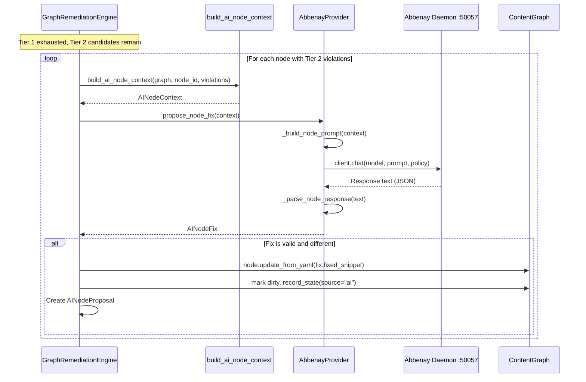

# 08 — Tier 2 AI-Assisted Remediation

> Previous: [07 — Tier 1 Deterministic Remediation](07-tier1-remediation.md) | Next: [09 — Post-AI Deterministic Pass](09-post-ai-deterministic.md)

## Purpose

When Tier 1 deterministic transforms are exhausted but Tier 2 violations
remain, the engine can optionally invoke an AI provider to propose fixes.
AI operates at the graph node level, receiving rich context from the
ContentGraph and returning corrected YAML.

## Sequence



## When AI Fires

AI remediation activates when ALL of these conditions are met:

1. Tier 1 has no remaining fixable violations
2. Tier 2 violations exist (task/block scope, not cross-file)
3. `FixOptions.enable_ai = True` (CLI: `--ai`)
4. An `AIProvider` is available (Abbenay daemon reachable)
5. `ai_attempts < max_ai_attempts` (default: 2)

## AIProvider Protocol

`src/apme_engine/remediation/ai_provider.py` defines the provider contract:

```python
class AIProvider(Protocol):
    async def propose_node_fix(
        self,
        context: AINodeContext,
        *,
        model: str | None = None,
    ) -> AINodeFix | None: ...
```

The engine depends only on this protocol. The concrete implementation
(`AbbenayProvider`) is the only file that imports `abbenay_grpc`.

## AINodeContext — Graph-Derived Context

`src/apme_engine/remediation/ai_context.py` — `build_ai_node_context()`
assembles everything the LLM needs:

| Field | Source | Purpose |
|-------|--------|---------|
| `yaml_lines` | `node.yaml_lines` | The YAML to fix |
| `violations` | Scoped to this node | What's wrong |
| `parent_context` | `graph.ancestors()` | Play vars, become, tags, when |
| `sibling_snippets` | `graph.children(parent)` | Surrounding tasks for awareness |
| `feedback` | Previous AI attempt | What went wrong last time |
| `node_type` | `node.node_type` | task, block, handler |
| `file_path` | `node.file_path` | Display context |

### Parent Context

Walks the ancestor chain and extracts inherited context that affects task
execution: play-level variables, become settings, tags, when conditions,
and environment variables.

### Sibling Snippets

Gets up to 2 preceding and 2 following sibling nodes from the same parent,
truncated to 20 lines each. Gives the LLM awareness of surrounding context
without overwhelming the prompt.

## AbbenayProvider

`src/apme_engine/remediation/abbenay_provider.py` — the default
implementation:

1. **Prompt construction** — `_build_node_prompt()` formats the
   `NODE_PROMPT_TEMPLATE` with violations, YAML, parent context, sibling
   snippets, relevant best practices, and feedback from prior attempts.

2. **LLM call** — `client.chat()` with `temperature=0.0`,
   `format=json_only`, `max_tokens=8192`, `timeout=60s`.

3. **Response parsing** — `_parse_node_response()` extracts JSON from the
   response (tolerant of markdown fences and preamble), returning an
   `AINodeFix` with `fixed_snippet`, `rule_ids`, `explanation`, `confidence`,
   and `skipped` entries.

### Best Practices Injection

The prompt includes relevant Ansible best practices keyed by rule category
(FQCN, YAML formatting, module usage, naming, Jinja2). Universal guidelines
are always included. Category-specific guidelines are added based on the
violation rule IDs.

## AINodeFix and AINodeProposal

**AINodeFix** (from the provider):
- `fixed_snippet` — corrected YAML text
- `rule_ids` — which violations were addressed
- `explanation` — human-readable summary
- `confidence` — 0.0-1.0 score
- `skipped` — violations the AI could not fix

**AINodeProposal** (stored on the graph report):
- `node_id`, `file_path`, `line_start`, `line_end`
- `before_yaml`, `after_yaml`
- `rule_ids`, `explanation`, `confidence`

Proposals are pending until human approval (Stage 10).

## Graph Integration

When an AI fix is accepted by the engine:

1. `node.update_from_yaml(fix.fixed_snippet)` — stores new YAML on the node
2. `graph._dirty_nodes.add(node_id)` — marks for rescan
3. `node.record_state(pass_num, "transformed", source="ai")` — tracks the
   change with AI attribution

AI changes are NOT auto-approved (unlike Tier 1). They remain pending in the
node's progression until the user explicitly approves or rejects them via the
approval flow.

## Feedback Loop

If AI fixes don't resolve all Tier 2 violations after rescan, feedback is
built from the remaining violations:

```
Your previous fix introduced or did not resolve these violations:
- [L013]: Task name is not descriptive
- [M004]: Module is not using FQCN
```

This feedback is passed to the next AI attempt via `AINodeContext.feedback`,
giving the LLM a chance to correct its approach. The loop is capped by
`max_ai_attempts` (default: 2).

## Provider Wiring

`PrimaryServicer._resolve_ai_provider()` creates an `AbbenayProvider` when:

1. `FixOptions.enable_ai` is set
2. Abbenay address is available (`APME_ABBENAY_ADDR` or auto-discovery)
3. A model is specified (`--model` or `APME_AI_MODEL`)
4. Optional token via `APME_ABBENAY_TOKEN`

Auto-discovery checks for Unix sockets at:
- `$XDG_RUNTIME_DIR/abbenay/daemon.sock`
- `/run/user/<uid>/abbenay/daemon.sock`
- `/tmp/abbenay/daemon.sock`

## Key Source Files

| File | Key types/functions |
|------|---------------------|
| `src/apme_engine/remediation/graph_engine.py` | `_apply_ai_transforms()`, `AINodeProposal` |
| `src/apme_engine/remediation/ai_provider.py` | `AIProvider` protocol, `AINodeFix`, `AISkipped` |
| `src/apme_engine/remediation/ai_context.py` | `build_ai_node_context()`, `AINodeContext` |
| `src/apme_engine/remediation/abbenay_provider.py` | `AbbenayProvider`, `_build_node_prompt()`, `_parse_node_response()` |
| `src/apme_engine/daemon/primary_server.py` | `_resolve_ai_provider()` |

## Related ADRs

- **ADR-024** — AI provider abstraction
- **ADR-025** — AI-assisted remediation (Tier 2)
- **ADR-044** — ContentGraph as working copy

---

> Next: [09 — Post-AI Deterministic Pass](09-post-ai-deterministic.md)
