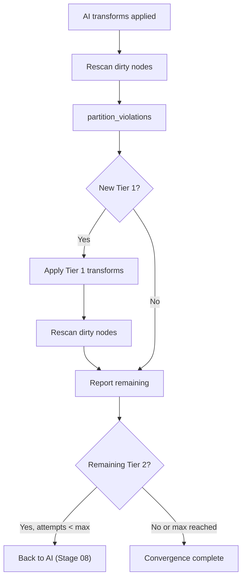

# 09 — Post-AI Deterministic Pass

> Previous: [08 — AI-Assisted Remediation](08-ai-remediation.md) | Next: [10 — Human Approval Flow](10-human-approval.md)

## Purpose

AI-generated fixes can introduce new Tier 1 violations. For example, an AI
fix that rewrites a task may introduce a task naming violation (L025) or
a YAML formatting issue (L007). The post-AI deterministic pass catches and
fixes these automatically.

## Why This Stage Exists

Consider an AI fix for a module FQCN violation (M001). The AI rewrites the
task, but the new name it gives the task violates the task naming rule
(L025). Without this cleanup pass, the user would see a new violation that
was not present before the AI fix.

The post-AI pass ensures that AI changes are as clean as possible before
being presented for human approval.

## Flow



## Implementation

This stage is not a separate function — it is part of Phase B in
`GraphRemediationEngine.remediate()`. After AI transforms are applied and
dirty nodes are rescanned:

```python
# Phase C: Post-AI Tier 1 cleanup
new_tier1, new_tier2, _ = partition_violations(violations, registry)
if new_tier1:
    self._progress("graph-tier1", f"Post-AI cleanup: {len(new_tier1)} Tier 1 violations")
    await self._apply_tier1(graph, registry, new_tier1, all_fixed, pass_num)
    violations = await self._rescan_and_record(graph, pass_num)
    _, new_tier2, _ = partition_violations(violations, registry)
```

The same `_apply_tier1()` function from Stage 07 is reused. The same
convergence safety (oscillation detection, dirty-node-only rescan) applies.

## Interaction Between AI and Deterministic Changes

Both AI and deterministic transforms modify the same `ContentGraph`. The
progression tracking ensures each change is attributed to its source:

- `source="ai"` — changes from `_apply_ai_transforms()`
- `source="deterministic"` — changes from `_apply_tier1()`

When the post-AI pass modifies a node that was already changed by AI, the
node gets additional progression entries. The final state reflects the
combined effect of both AI and deterministic transforms.

After the post-AI pass, if new Tier 2 violations remain, feedback is built
and the AI resubmission loop may fire again (up to `max_ai_attempts`).

## Key Source Files

| File | Key functions |
|------|---------------|
| `src/apme_engine/remediation/graph_engine.py` | `remediate()` Phase B-C, `_apply_tier1()` |

## Related ADRs

- **ADR-044** — ContentGraph as working copy (supports multi-source transforms)

---

> Next: [10 — Human Approval Flow](10-human-approval.md)
