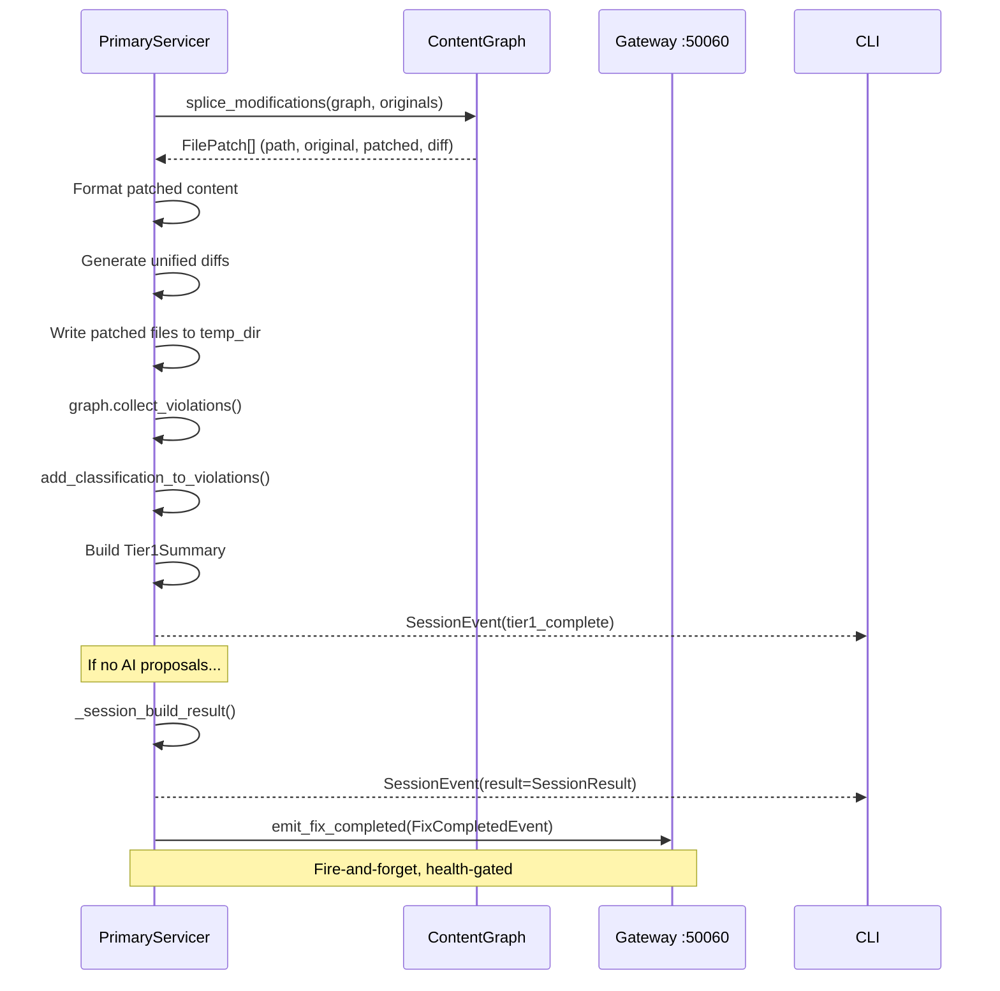

# 11 — Result Assembly and Reporting

> Previous: [10 — Human Approval Flow](10-human-approval.md) | Next: [12 — CLI Output and Presentation](12-output-and-presentation.md)

## Purpose

After convergence and approval, the Primary assembles the final
`SessionResult` containing file patches, remaining violations, and the fix
report. It also emits a `FixCompletedEvent` to the Gateway for persistence.

## Sequence



## splice_modifications()

`src/apme_engine/remediation/graph_engine.py` — this function bridges the
in-memory `ContentGraph` back to file content:

1. **Identify modified nodes** — nodes with at least two progression entries
   where the original hash differs from the effective (approved) hash.

2. **Group by file** — collect `(line_start, line_end, yaml_lines, rule_ids)`
   edits per file.

3. **Bottom-up splice** — sort edits by `line_start` descending so that
   splicing one edit does not shift line numbers for edits above it. Replace
   `lines[line_start-1:line_end]` with the new YAML text.

4. **Generate diffs** — `difflib.unified_diff()` between original and patched
   content.

5. **Return `FilePatch`** — path, original text, patched text, diff, and
   rule IDs.

The `include_pending` parameter controls whether to use the latest
progression entry (for convergence rescans) or only approved entries (for
final output).

## Post-Splice Formatting

Each patched file is run through `format_content()` again to ensure the
spliced YAML conforms to formatting conventions. The formatted result
replaces the patched content before diff generation.

## SessionResult

`_session_build_result()` constructs the final `SessionResult` proto:

```protobuf
message SessionResult {
  repeated FilePatch patches = 1;
  FixReport report = 2;
  repeated Violation remaining_violations = 3;
  repeated Violation fixed_violations = 4;
}
```

- **patches** — per-file diffs (original bytes, patched bytes, unified diff)
- **report** — `FixReport` with pass count, fixed count, remaining AI/manual
  counts, oscillation flag
- **remaining_violations** — violations that persist after remediation
- **fixed_violations** — violations resolved by transforms

## FixReport

```protobuf
message FixReport {
  int32 passes = 1;
  int32 fixed = 2;
  int32 remaining_ai = 3;
  int32 remaining_manual = 4;
  bool oscillation_detected = 5;
  repeated Violation remaining_violations = 6;
  repeated Violation fixed_violations = 7;
}
```

The report is built from the `GraphFixReport` returned by the convergence
loop, enriched with remediation class counts from `partition.py`.

## Event Emission

After sending the `SessionResult` to the client, the Primary emits a
`FixCompletedEvent` to the Gateway for persistence:

```python
await emit_fix_completed(self._build_fix_event(session, ...))
```

### FixCompletedEvent

`proto/apme/v1/reporting.proto` — carries everything the Gateway needs to
persist the scan:

| Field | Content |
|-------|---------|
| `scan_id` | Correlation identifier |
| `session_id` | Session hash |
| `project_path` | Project root path |
| `source` | "cli" |
| `remaining_violations` | Proto violations |
| `fixed_violations` | Proto violations |
| `summary` | ScanSummary (total, auto_fixable, ai_candidate, manual_review) |
| `report` | FixReport |
| `proposals` | ProposalOutcome[] (approved/rejected) |
| `logs` | ProgressUpdate[] (pipeline logs) |
| `patches` | FilePatch[] (per-file diffs) |
| `manifest` | ProjectManifest (collections, packages, dependency tree) |
| `content_graph_json` | Serialized ContentGraph |

### Fire-and-Forget Design

Event emission is **best-effort and health-gated** (ADR-020):

- Uses `GrpcReportingSink` with periodic health probes
- When the Gateway is unavailable, events are dropped (not queued)
- Failure never blocks the scan/fix path
- Short fast-fail timeout (1s) when endpoint is known-down

This ensures the engine scan path is never bottlenecked by persistence.

## ProjectManifest

`_build_manifest()` constructs the manifest from session state:

- `ansible_core_version` — from the session venv
- `collections[]` — `CollectionRef` protos with FQCN, version, source
  (specified/learned/dependency), license, supplier
- `python_packages[]` — `PythonPackageRef` protos with name, version,
  license, supplier
- `requirements_files` — paths to discovered requirements files
- `dependency_tree` — raw `uv pip tree` output

## Key Source Files

| File | Key types/functions |
|------|---------------------|
| `src/apme_engine/remediation/graph_engine.py` | `splice_modifications()`, `FilePatch`, `GraphFixReport` |
| `src/apme_engine/daemon/primary_server.py` | `_session_build_result()`, `_build_fix_event()`, `_build_manifest()` |
| `src/apme_engine/daemon/event_emitter.py` | `emit_fix_completed()`, `EventSink` protocol |
| `src/apme_engine/daemon/sinks/grpc_reporting.py` | `GrpcReportingSink` |
| `proto/apme/v1/reporting.proto` | `FixCompletedEvent`, `ReportAck` |
| `proto/apme/v1/primary.proto` | `SessionResult`, `FixReport`, `FilePatch` |

## Related ADRs

- **ADR-020** — Event sink abstraction (engine emits, never queries out)
- **ADR-029** — Stateless engine, persistence at the edge
- **ADR-040** — Dependency manifest (ProjectManifest)

---

> Next: [12 — CLI Output and Presentation](12-output-and-presentation.md)
