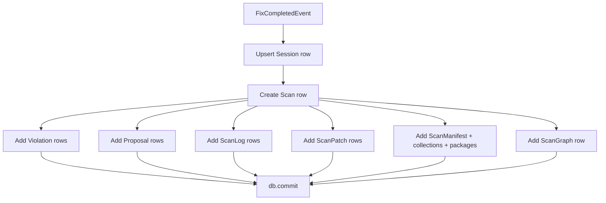
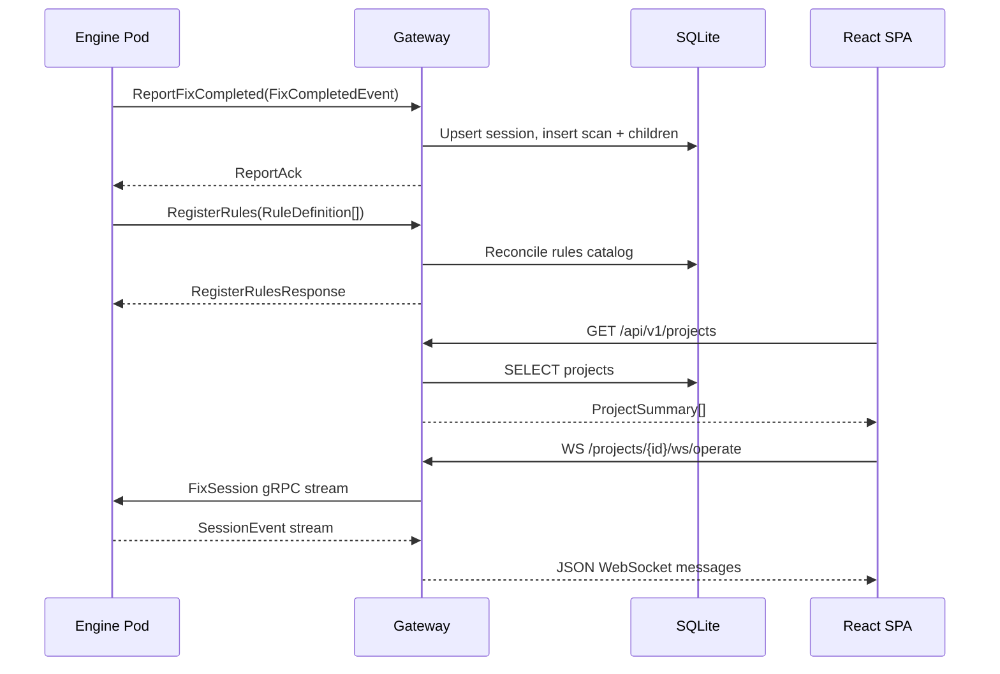

# 13 — Gateway and Persistence

> Previous: [12 — CLI Output and Presentation](12-output-and-presentation.md) | Next: [14 — UI and WebSocket Integration](14-ui-integration.md)

## Purpose

The Gateway is the persistence and REST API layer for APME. It receives
scan/fix events from the engine via gRPC, stores them in SQLite, and
serves a read-oriented REST API for dashboards and the React UI. It also
bridges WebSocket connections from the browser to Primary's `FixSession`
gRPC stream, enabling the UI to run check/remediate operations directly.

## Architecture

The Gateway runs two servers concurrently from a single process:

```mermaid
flowchart LR
    subgraph gateway [Gateway Process]
        direction TB
        GRPC["gRPC Reporting\n:50060"]
        HTTP["FastAPI + Uvicorn\n:8080"]
        DB[(SQLite)]
    end

    Engine -->|FixCompletedEvent| GRPC
    Engine -->|RegisterRules| GRPC
    GRPC -->|ORM rows| DB
    HTTP -->|read queries| DB
    UI["React SPA :8081"] -->|REST /api/v1/*| HTTP
    UI -->|WS /ws/session| HTTP
    UI -->|WS /projects/{id}/ws/operate| HTTP
    HTTP -->|gRPC FixSession| Engine
```

### Dual-Server Lifecycle

`src/apme_gateway/main.py` orchestrates both servers:

1. Initialize the SQLite database (`init_db`)
2. Launch gRPC Reporting server and FastAPI/Uvicorn HTTP server
   concurrently via `asyncio.gather()`
3. Wait for `SIGINT`/`SIGTERM` via a shared `asyncio.Event`
4. Gracefully stop both servers and close the database

Configuration is environment-variable driven:

| Variable | Default | Purpose |
|----------|---------|---------|
| `APME_GATEWAY_GRPC_LISTEN` | `0.0.0.0:50060` | gRPC bind address |
| `APME_GATEWAY_HTTP_PORT` | `8080` | HTTP bind port |
| `APME_DB_PATH` | `/data/apme.db` | SQLite database path |

## gRPC Reporting Servicer

`src/apme_gateway/grpc_reporting/servicer.py` — `ReportingServicer`
implements two RPCs defined in `proto/apme/v1/reporting.proto`:

### ReportFixCompleted

Receives a `FixCompletedEvent` from the engine after a scan/fix session
completes. Decomposes the event into ORM rows in a single transaction:



Each child record is linked to the `Scan` via `scan_id`. Violations are
stored for both `remaining_violations` and `fixed_violations` from the
event. The manifest includes collection and Python package rows with
deduplication on FQCN.

### RegisterRules

Receives the full rule catalog from an authority Primary on startup.
Performs a full reconciliation against the existing catalog:

- **New rules** — inserted
- **Removed rules** — deleted (cascades to overrides)
- **Existing rules** — updated with latest metadata

Only accepted from pods with `is_authority=True`. Non-authority
registrations are logged and rejected.

## Database Schema

`src/apme_gateway/db/models.py` defines the SQLAlchemy ORM models using
`DeclarativeBase`. The schema is organized around two top-level entities:

### Entity Relationships

```
Project (ADR-037)           Session (CLI/playground)
   │                            │
   └──► Scan ◄──────────────────┘
         │
         ├── Violation[]
         ├── Proposal[]
         ├── ScanLog[]
         ├── ScanPatch[]
         ├── ScanManifest (1:1)
         │    ├── ScanCollection[]
         │    └── ScanPythonPackage[]
         ├── ScanGraph (1:1)
         └── (project_id nullable for CLI scans)

Rule (ADR-041)
   └── RuleOverride (1:1)

GalaxyServer (ADR-045)
```

### Key Tables

| Table | Purpose |
|-------|---------|
| `projects` | SCM-backed project definitions (name, repo URL, branch, health score) |
| `sessions` | CLI session tracking by deterministic hash |
| `scans` | Individual check/remediate runs with summary counts |
| `violations` | Per-violation records (rule, severity, file, line, snippet) |
| `proposals` | AI proposal outcomes (approved/rejected/pending) |
| `scan_logs` | Structured pipeline log entries |
| `scan_patches` | Per-file unified diffs |
| `scan_manifests` | Dependency manifest metadata (ansible-core version, requirements) |
| `scan_collections` | Collection references per scan (FQCN, version, source, license) |
| `scan_python_packages` | Python package references per scan |
| `scan_graphs` | Serialized ContentGraph JSON |
| `rules` | Registered rule catalog from engine |
| `rule_overrides` | Admin-configured severity/enabled overrides |
| `galaxy_servers` | Global Galaxy/Automation Hub server definitions (ADR-045) |

All timestamps are stored as ISO 8601 strings. The database uses
aiosqlite for async access via SQLAlchemy's async session factory.

## REST API

`src/apme_gateway/api/router.py` defines the FastAPI router under
`/api/v1`. All read endpoints query the SQLite database; write operations
originate from the gRPC Reporting servicer (push model) or project CRUD.

### Endpoint Categories

#### Health

| Method | Path | Purpose |
|--------|------|---------|
| GET | `/health` | Database + upstream service health (gRPC probes) |
| GET | `/ai/models` | List available AI models from Primary/Abbenay |

#### Projects (ADR-037)

| Method | Path | Purpose |
|--------|------|---------|
| POST | `/projects` | Create a project |
| GET | `/projects` | List projects (paginated, sortable) |
| GET | `/projects/{id}` | Project detail with severity breakdown |
| PATCH | `/projects/{id}` | Update project metadata |
| DELETE | `/projects/{id}` | Delete project (cascades to scans) |
| GET | `/projects/{id}/activity` | Project activity history |
| GET | `/projects/{id}/violations` | Latest violations (filterable) |
| GET | `/projects/{id}/trend` | Violation trend over time |
| GET | `/projects/{id}/dependencies` | Dependency manifest (ADR-040) |
| GET | `/projects/{id}/sbom` | CycloneDX 1.5 SBOM export |
| GET | `/projects/{id}/graph` | ContentGraph JSON for visualization |

#### Sessions and Activity

| Method | Path | Purpose |
|--------|------|---------|
| GET | `/sessions` | List sessions |
| GET | `/sessions/{id}` | Session detail with scans |
| GET | `/sessions/{id}/trend` | Session violation trend |
| GET | `/activity` | List all activity (optionally by session) |
| GET | `/activity/{id}` | Full activity detail (violations, proposals, logs, patches) |
| DELETE | `/activity/{id}` | Delete an activity record |

#### Dashboard

| Method | Path | Purpose |
|--------|------|---------|
| GET | `/dashboard/summary` | Cross-project aggregates |
| GET | `/dashboard/rankings` | Ranked projects by health score |
| GET | `/violations/top` | Most violated rules |
| GET | `/stats/remediation-rates` | Per-rule fix frequencies |
| GET | `/stats/ai-acceptance` | AI proposal approval statistics |

#### Rule Catalog (ADR-041)

| Method | Path | Purpose |
|--------|------|---------|
| GET | `/rules` | List rules with resolved config |
| GET | `/rules/stats` | Catalog statistics (by category, source) |
| GET | `/rules/{id}` | Single rule with override detail |
| PUT | `/rules/{id}/config` | Create/update rule override |
| DELETE | `/rules/{id}/config` | Revert to catalog defaults |

#### Collections and Packages (ADR-040)

| Method | Path | Purpose |
|--------|------|---------|
| GET | `/collections` | All collections with usage counts |
| GET | `/collections/{fqcn}` | Collection detail with dependent projects |
| GET | `/python-packages` | All packages with usage counts |
| GET | `/python-packages/{name}` | Package detail |

#### Dependency Health

| Method | Path | Purpose |
|--------|------|---------|
| GET | `/dep-health` | Aggregated collection health findings and Python CVEs |
| GET | `/projects/{id}/dep-health` | Project-scoped dependency health summary |

#### Galaxy Server Settings (ADR-045)

| Method | Path | Purpose |
|--------|------|---------|
| GET | `/settings/galaxy-servers` | List configured Galaxy servers |
| POST | `/settings/galaxy-servers` | Add a Galaxy server |
| PATCH | `/settings/galaxy-servers/{id}` | Update a Galaxy server |
| DELETE | `/settings/galaxy-servers/{id}` | Remove a Galaxy server |

### Health Probing

The `/health` endpoint probes all upstream services:

- **gRPC services** — uses the standard `grpc.health.v1.Health` check
  protocol; treats `UNIMPLEMENTED` as reachable
- **HTTP services** — GET to the base URL; any non-5xx response is OK
- **Database** — executes a simple count query

Returns an overall status of `"ok"` or `"degraded"`.

## WebSocket Endpoints

Two WebSocket endpoints bridge the browser to the engine:

### `/ws/session` — Playground

`session_client.py` handles the full lifecycle:

1. Client uploads files as base64 JSON messages
2. Gateway writes files to a temp directory
3. Gateway opens a `FixSession` gRPC stream to Primary
4. Bidirectional forwarding: gRPC events to WS JSON, WS commands to gRPC
5. Supports session resume via `?resume=<session_id>`

### `/projects/{id}/ws/operate` — Project Operations

The project WebSocket endpoint:

1. Client sends `{"action": "check"|"remediate", "options": {...}}`
2. Gateway clones the project's repo
3. Gateway drives `FixSession` via `run_project_operation()`
4. Streams progress, proposals, and results back to the client
5. After completion, links the scan to the project and updates health score

Both WebSocket handlers tolerate client disconnects — they continue
draining gRPC events so the Primary finishes normally and the Reporting
servicer receives the `FixCompletedEvent`.

## Data Flow Summary



## Key Source Files

| File | Key types/functions |
|------|---------------------|
| `src/apme_gateway/main.py` | `_run_grpc()`, `_run_http()`, `_run()` |
| `src/apme_gateway/app.py` | `create_app()` — FastAPI factory |
| `src/apme_gateway/grpc_reporting/servicer.py` | `ReportingServicer`, `ReportFixCompleted`, `RegisterRules` |
| `src/apme_gateway/api/router.py` | REST + WebSocket route definitions |
| `src/apme_gateway/session_client.py` | `handle_session()` — playground WS-to-gRPC bridge |
| `src/apme_gateway/db/models.py` | ORM model definitions |
| `src/apme_gateway/db/queries.py` | Database query functions |
| `src/apme_gateway/config.py` | `load_config()` — environment-based configuration |
| `proto/apme/v1/reporting.proto` | `Reporting` service definition |

## Related ADRs

- **ADR-020** — Event sink abstraction (engine pushes, Gateway persists)
- **ADR-029** — Stateless engine, persistence at the edge (Gateway)
- **ADR-037** — Project-centric UI and API
- **ADR-040** — Dependency manifest (ProjectManifest / SBOM)
- **ADR-041** — Rule catalog and overrides
- **ADR-045** — Galaxy server settings

---

> Next: [14 — UI and WebSocket Integration](14-ui-integration.md)
