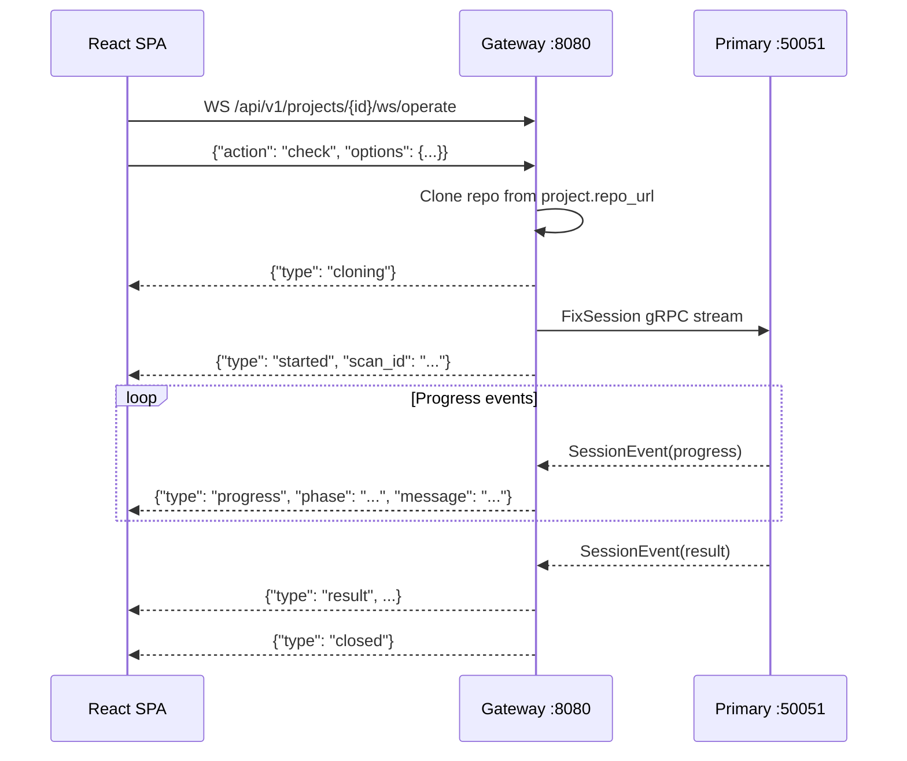

# 14 — UI and WebSocket Integration

> Previous: [13 — Gateway and Persistence](13-gateway-and-persistence.md) | Next: [15 — Concurrency Model](15-concurrency-model.md)

## Purpose

The APME UI is a React single-page application served by nginx on port
8081. It consumes the Gateway's REST API for dashboards and activity
history, and connects via WebSocket for real-time check/remediate
operations. This document covers the frontend architecture, the WebSocket
protocol, and how UI interactions map to the engine pipeline.

## Stack

| Layer | Technology |
|-------|------------|
| Framework | React 18+ with hooks |
| UI library | PatternFly 6 (`@patternfly/react-core`) |
| Layout | `@ansible/ansible-ui-framework` (`PageLayout`, `PageHeader`) |
| Routing | React Router v6 |
| HTTP client | Native `fetch` API (no axios) |
| WebSocket | Native `WebSocket` API via custom hooks |
| Build | Vite |
| Deployment | nginx static file server in the pod |

## Page Structure

The SPA is organized into pages, each mapped to a route:

| Page | Route | Purpose |
|------|-------|---------|
| `DashboardPage` | `/` | Cross-project summary, rankings, trends |
| `ProjectsPage` | `/projects` | Project list with health scores |
| `ProjectDetailPage` | `/projects/:id` | Project detail with tabs: Overview, Activity, Violations, Dependencies, Visualize, Settings |
| `ActivityPage` | `/activity` | Global activity feed |
| `ActivityDetailPage` | `/activity/:id` | Single scan detail (violations, proposals, patches, logs) |
| `SessionsPage` | `/sessions` | CLI session list |
| `SessionDetailPage` | `/sessions/:id` | Session detail with trend |
| `RulesPage` | `/rules` | Rule catalog with override management |
| `CollectionsPage` | `/collections` | Cross-project collection inventory |
| `CollectionDetailPage` | `/collections/:fqcn` | Collection detail and dependent projects |
| `PythonPackagesPage` | `/python-packages` | Cross-project Python package inventory |
| `PythonPackageDetailPage` | `/python-packages/:name` | Package detail |
| `AnalyticsPage` | `/analytics` | Remediation rates, AI acceptance stats |
| `PlaygroundPage` | `/playground` | File-upload check/remediate sandbox |
| `HealthPage` | `/health` | Component health dashboard |
| `SettingsPage` | `/settings` | Galaxy server configuration, AI model selection |

## API Service Layer

`frontend/src/services/api.ts` wraps all REST calls with a typed
`request<T>()` helper that:

- Prefixes all paths with `/api/v1`
- Sets `Accept: application/json`
- Throws on non-2xx responses with status and body text
- Returns typed responses

Key API groups:

```
Health          → getHealth()
Projects        → createProject(), listProjects(), getProject(), updateProject(), deleteProject()
Project scoped  → listProjectActivity(), listProjectViolations(), getProjectTrend(),
                  getProjectDependencies(), getProjectGraph(), getProjectSbom(),
                  getProjectDepHealth()
Dep Health      → getDepHealth(), getProjectDepHealth()
Sessions        → listSessions(), getSession(), getSessionTrend()
Activity        → listActivity(), getActivity(), deleteActivity()
Dashboard       → getDashboardSummary(), getDashboardRankings()
Rules           → listRules(), getRule(), updateRuleConfig(), deleteRuleConfig(), getRuleStats()
Collections     → listCollections(), getCollectionDetail(), listCollectionProjects()
Packages        → listPythonPackages(), getPythonPackageDetail()
Analytics       → getTopViolations(), getRemediationRates(), getAiAcceptance()
Galaxy Servers  → listGalaxyServers(), createGalaxyServer(), updateGalaxyServer(), deleteGalaxyServer()
AI Models       → listAiModels()
```

## WebSocket Integration

### Project Operations

`useProjectOperation` (`frontend/src/hooks/useProjectOperation.ts`) is the
primary React hook for check/remediate operations via WebSocket:



#### Hook State Machine

```
idle → connecting → cloning → checking → complete
                                  ↓
                         awaiting_approval → applying → complete
                                  ↓
                                error
```

| State | Meaning |
|-------|---------|
| `idle` | No operation in progress |
| `connecting` | WebSocket connecting |
| `cloning` | Gateway cloning the project repo |
| `checking` | Scan/fix pipeline running |
| `awaiting_approval` | AI proposals ready for review |
| `applying` | Approved proposals being applied |
| `complete` | Operation finished |
| `error` | Operation failed |

#### Message Protocol (Browser → Gateway)

| Message | Purpose |
|---------|---------|
| `{"type": "start", "remediate": bool, "options": {...}}` | Start check/remediate |
| `{"type": "approve", "approved_ids": [...]}` | Approve AI proposals |
| `{"type": "cancel"}` | Cancel operation |

#### Message Protocol (Gateway → Browser)

| Message | Purpose |
|---------|---------|
| `{"type": "cloning"}` | Repo clone in progress |
| `{"type": "started", "scan_id": "..."}` | Pipeline started |
| `{"type": "progress", "phase": "...", "message": "...", "level": N}` | Pipeline progress |
| `{"type": "proposals", "proposals": [...]}` | AI proposals ready |
| `{"type": "approval_ack", "applied_count": N}` | Approvals applied |
| `{"type": "result", "total_violations": N, ...}` | Final results |
| `{"type": "error", "message": "..."}` | Error occurred |
| `{"type": "closed"}` | Session finished |

### Playground Sessions

The `PlaygroundPage` uses a separate WebSocket endpoint (`/ws/session`)
via `session_client.py` on the Gateway side. The protocol differs
slightly:

1. Client sends `{"type": "start", "options": {...}}` with scan options
2. Client uploads files as `{"type": "file", "path": "...", "content": "<base64>"}`
3. Client signals `{"type": "files_done"}` to begin processing
4. Gateway bridges to Primary's `FixSession` and forwards events
5. Supports `{"type": "approve", "approved_ids": [...]}` for AI approval
6. Supports session resume via `?resume=<session_id>` query parameter

## Project Detail Page

The `ProjectDetailPage` is the central UI for interacting with a project.
It uses tabs to organize functionality:

### Overview Tab
- Health score, violation count, activity count, last checked time
- Severity breakdown by category
- Violation trend chart (when 2+ data points exist)
- During operations: progress panel, proposal review, or result card

### Activity Tab
- Check options form (ansible version, collections, AI toggle)
- Check and Remediate buttons
- Activity history table with type, status, violation counts, AI stats

### Violations Tab
- Sortable violation table from latest scan
- Expandable message rows for long descriptions
- Severity-ordered display

### Dependencies Tab
- Ansible core version
- Collection table (FQCN, version, source) — clickable to collection detail
- Python package table — clickable to package detail
- Requirements file list
- SBOM download button (CycloneDX JSON)

### Visualize Tab
- ContentGraph visualization (loaded on demand)
- Uses `GraphVisualization` component for D3/dagre rendering

### Settings Tab
- Project name, repo URL, branch editing
- Delete project action

## Operation UI Components

### OperationProgressPanel
Renders real-time progress entries during check/remediate. Shows phase
badges and messages streaming in as `progress` WebSocket events arrive.
Includes a cancel button.

### ProposalReviewPanel
Displays AI proposals with diff hunks, rule IDs, confidence scores, and
explanations. Users can approve/reject individual proposals or
accept/skip all. Sends `approve` message via WebSocket.

### OperationResultCard
Shows the final operation summary: total violations, fixed count, AI
proposed/accepted/declined counts, manual review count.

### StatusBadge
Visual badge showing scan status (pass/fail/running) based on violation
count and scan type.

### TrendChart
Line chart showing violation count trends over time for a project or
session.

## Data Flow: UI Check Operation

```mermaid
flowchart TD
    A[User clicks Check] --> B[useProjectOperation.startOperation]
    B --> C[WebSocket connect to /projects/{id}/ws/operate]
    C --> D[Send start message with options]
    D --> E[Gateway clones repo]
    E --> F[Gateway opens FixSession to Primary]
    F --> G[Progress events stream to UI]
    G --> H{AI proposals?}
    H -->|Yes| I[ProposalReviewPanel shown]
    I --> J[User approves/rejects]
    J --> K[approve message sent via WS]
    H -->|No| L[Result received]
    K --> L
    L --> M[OperationResultCard displayed]
    M --> N[fetchData refreshes project state]
    N --> O[Gateway links scan to project]
    O --> P[Health score updated]
```

## Deployment

The React SPA is built by Vite into static files and served by nginx:

```
Container: apme-ui (:8081)
├── nginx.conf (reverse proxy + static serve)
├── /usr/share/nginx/html/
│   ├── index.html
│   ├── assets/
│   │   ├── index-*.js
│   │   └── index-*.css
│   └── ...
└── Proxies /api/* → gateway:8080
```

Nginx handles:
- Static file serving for the SPA
- Reverse proxying `/api/*` requests to the Gateway
- WebSocket upgrade for `/api/v1/ws/*` and `/api/v1/projects/*/ws/*`
- SPA fallback (all non-asset routes serve `index.html`)

## Key Source Files

| File | Purpose |
|------|---------|
| `frontend/src/services/api.ts` | Typed REST API client |
| `frontend/src/hooks/useProjectOperation.ts` | WebSocket hook for project operations |
| `frontend/src/pages/ProjectDetailPage.tsx` | Main project interaction page |
| `frontend/src/pages/DashboardPage.tsx` | Cross-project dashboard |
| `frontend/src/pages/PlaygroundPage.tsx` | File-upload sandbox |
| `frontend/src/pages/RulesPage.tsx` | Rule catalog and override management |
| `frontend/src/pages/ActivityDetailPage.tsx` | Scan detail (violations, logs, patches) |
| `frontend/src/components/GraphVisualization.tsx` | ContentGraph D3 visualization |
| `frontend/src/components/OperationProgressPanel.tsx` | Real-time progress display |
| `frontend/src/components/ProposalReviewPanel.tsx` | AI proposal review UI |
| `frontend/src/components/OperationResultCard.tsx` | Operation result summary |
| `frontend/src/components/TrendChart.tsx` | Violation trend line chart |

## Related ADRs

- **ADR-029** — Stateless engine, persistence at the edge
- **ADR-037** — Project-centric UI and API
- **ADR-039** — Unified FixSession for check and remediate
- **ADR-040** — Dependency manifest and SBOM
- **ADR-041** — Rule catalog and overrides
- **ADR-045** — Galaxy server settings

---

> Next: [15 — Concurrency Model](15-concurrency-model.md)
