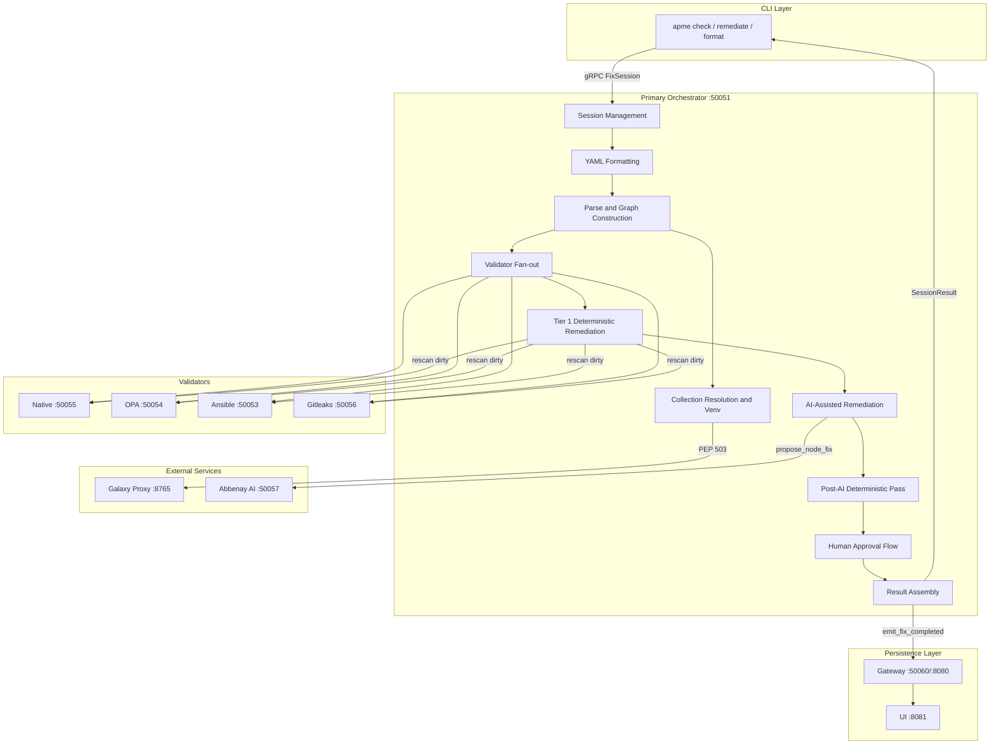

# APME Architecture Pipeline

This directory documents **how APME works at runtime** — the processing
pipeline as a numbered sequence of stages, from CLI invocation through to
final output.

> **architecture/** vs **design/**: Architecture docs describe the runtime
> pipeline — what happens, in what order, and how data flows between
> services. Design docs (in `../design/`) explain **why** a subsystem was
> built the way it was — alternatives considered, trade-offs, and rationale.

The former monolithic `ARCHITECTURE.md` and `DATA_FLOW.md` have been
[archived](../archive/); their content is now covered by docs 00–17
below.

## Pipeline Overview

## Stage Documents

| # | Document | Stage |
|---|----------|-------|
| 00 | [00-overview.md](00-overview.md) | Pipeline overview, check vs remediate vs format |
| 01 | [01-initialization-and-ingestion.md](01-initialization-and-ingestion.md) | CLI initialization and file ingestion |
| 02 | [02-session-management.md](02-session-management.md) | Session creation and file staging |
| 03 | [03-formatting.md](03-formatting.md) | YAML formatting and idempotency check |
| 04 | [04-parse-and-graph.md](04-parse-and-graph.md) | Parse, graph construction, and hierarchy |
| 05 | [05-collection-resolution.md](05-collection-resolution.md) | Collection resolution and venv management |
| 06 | [06-validator-fanout.md](06-validator-fanout.md) | Validator fan-out and violation detection |
| 07 | [07-tier1-remediation.md](07-tier1-remediation.md) | Tier 1 deterministic remediation |
| 08 | [08-ai-remediation.md](08-ai-remediation.md) | Tier 2 AI-assisted remediation |
| 09 | [09-post-ai-deterministic.md](09-post-ai-deterministic.md) | Post-AI deterministic pass |
| 10 | [10-human-approval.md](10-human-approval.md) | Human approval flow |
| 11 | [11-result-assembly.md](11-result-assembly.md) | Result assembly and reporting |
| 12 | [12-output-and-presentation.md](12-output-and-presentation.md) | CLI output and presentation |
| 13 | [13-gateway-and-persistence.md](13-gateway-and-persistence.md) | Gateway persistence and REST API |
| 14 | [14-ui-integration.md](14-ui-integration.md) | UI and WebSocket integration |
| 15 | [15-concurrency-model.md](15-concurrency-model.md) | Concurrency model and executor discipline |
| 16 | [16-diagnostics.md](16-diagnostics.md) | Diagnostics instrumentation and timing |
| 17 | [17-scaling-and-deployment.md](17-scaling-and-deployment.md) | Scaling strategy and deployment topology |

## Cross-References

- [DESIGN_REMEDIATION.md](../design/DESIGN_REMEDIATION.md) — remediation engine design
- [DESIGN_VALIDATORS.md](../design/DESIGN_VALIDATORS.md) — validator design
- [DESIGN_AI_ESCALATION.md](../design/DESIGN_AI_ESCALATION.md) — AI escalation design
- ADR index: [.sdlc/adrs/README.md](../../.sdlc/adrs/README.md)

## Reading Guide

Start with [00-overview.md](00-overview.md) for the big picture, then read
sequentially or jump to a specific stage. Each document references its
neighbors with "Previous" and "Next" links.
